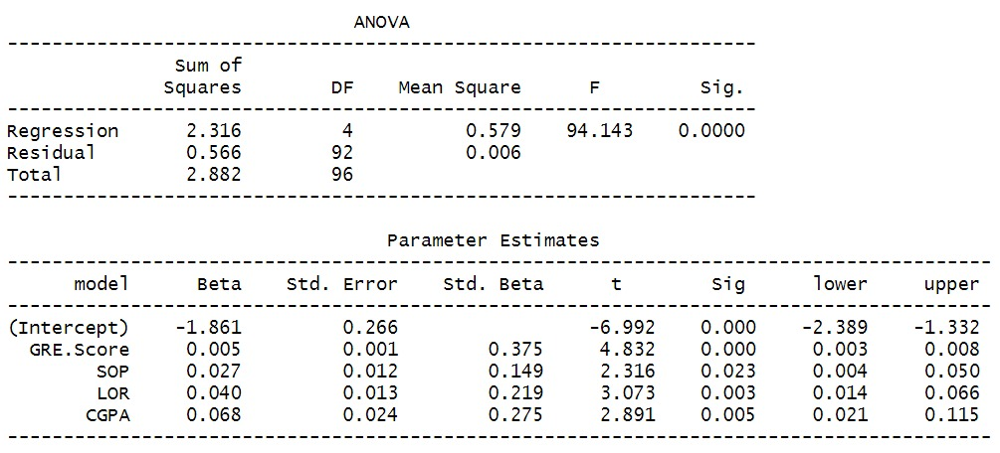

---
header-includes:
- \usepackage{longtable}
- \usepackage[utf8]{inputenc}
- \usepackage[spanish]{babel}\decimalpoint
- \setlength{\parindent}{1.25cm}
- \usepackage{amsmath}
output: 
  pdf_document:
    number_sections: true
fontsize: 12pt
papersize: letter
geometry: margin = 1in
language: "es"
---

```{r setup, include=FALSE}
knitr::opts_chunk$set(echo = TRUE)
library(dplyr)
library(knitr)
library(kableExtra)
library(GGally)
library(rsm)
library(car)
library(leaps)
library(MASS)
library(perturb)
library(olsrr)
library(corrplot)

ggplot2::theme_set(ggplot2::theme_bw()) 
```

\input{titlepage}
\thispagestyle{empty}
\tableofcontents
\listoffigures
\listoftables

\newpage

\pagestyle{myheadings}
\setcounter{page}{1}

Se realizará una análisis de regresión lineal múltiple(RLM): 

$$Y_i = \beta_0 + \beta_{1} x_{i1} + \beta_2 x_{i2} + \cdots + \beta_k x_{ik} + \varepsilon_i, \ \varepsilon {\stackrel{iid} \sim} N(0, \sigma^2)$$

Con la intención de validar si dicho modelo es adecuado para explicar la posibilidad de ser admitido a una carrera de postgrado en la india teniendo en cuenta determinadas pruebas de aptitud.

```{r, echo = F}
data <- read.csv("AdmissionPredict.csv", sep=",", dec=".")
data <- data[1:100, -c(1,4,8)]
```

\section{Base de datos}
\subsection{Breve Descripción de los Datos}

La base de datos disponible en Kaggle corresponde a puntajes de admision creados para la predicción de las admisiones de posgrado en La India. 
Cuenta con 400 observaciones y 9 variables. De las cuales se consideran los primeros 100 estudiantes y 6 variables de interes por indicación de la docente.

|**Variables**|**Descripción**|
|-----------|-------------| 
|**Chance.of.Admit:**| Posibilidad de ser admitido. Variable numérica continua de 0-1.|
|**GRE Score:**      | Puntaje de Examen que proporciona a las escuelas una medida común para la comparación de la capacidad de razonamiento verbal, razonamiento cuantitativo, y habilidades para pensar y escribir de forma analítica. Variable numérica que toma valores de 294 - 340.|
|**TOEFL Score:**    | Puntaje en prueba estandarizada de dominio del idioma inglés. Variable numérica que toma valores del 93 - 120.|
|**SOP:**            | Puntaje en Ensayo de admisión o solicitud de postgrado. Variable numérica que toma valores del 1 - 5, tomando el valor medio entre cada par de enteros en el intervalo.|
|**LOR:**            | Puntaje en Carta de recomendación. Variable numérica que toma valores del 1.5 - 5, tomando el valor medio entre cada par de enteros en el intervalo.|
|**CGPA:**           | Promedio general acumulado en el pregrado. Variable numérica que toma valores del 6.8 - 9.8.| 


\subsection{Renombrando las variables:}

- **GRE Score** = $X_1$

- **TOEFL Score** = $X_2$

- **SOP** = $X_3$

- **LOR** = $X_4$

- **CGPA** = $X_5$


\section{Análisis descriptivo}
\subsection{Grafico de dispersión con Matriz de Correlaciones y conclusiones}

```{r, echo = F}
#Matriz de dispersión con histogramas en la diagonal
gg2<-ggpairs(data,upper=list(continuous = wrap("smooth",alpha = 0.3, size=1.2,method = "lm")),lower=list(continuous ="cor"))
for(i in 1:ncol(data)){
gg2[i,i]<-gg2[i,i]+
geom_histogram(breaks=hist(data[,i],breaks = "FD",plot=F)$breaks,
               colour = "red",fill="lightgoldenrod1")
}

gg2
```

- Se observan relaciones de interés.
 
- La variable **Chance.of.Admit** (Posibilidad de ser admitido) se encuentran altamente correlacionada con las variables **GRE.Score**, **TOFL.Score**, **SOP**, **LOR** y **CGPA** con correlaciones de **0.808**, **0.780**, **0.614**, **0.743** y **0.833** respectivamente. Con relaciones del tipo lineales positivas. 
 
- La variable **CGPA** (Promedio general acumulado en el pregrado) se encuentran altamente correlaciona con las variables **GRE.Score**, **TOFL.Score**, **SOP** y **LOR** con correlaciones de **0.804**, **0.812**,**0.652**y **0.739** respectivamente. Con relaciones del tipo lineales positivas. Esto nos puede indicar redundancia en el modelo o multicolinealidad lo cual validaremos más adelante.

- La variable **GRE.Score** se encuentra altamente correlacionadas con las variables **TOFL.Score** y  **CGPA**. Y moderadamente con las variables **SOP** y **LOR**.
 
\section{Modelo Ajustado de Regresion Lineal múltiple (MRLM)}
```{r, echo = F}
model = lm(data$Chance.of.Admit~., data)
```
\subsection{Tabla de parámetros ajustados}
```{r, echo = F}
tabla.coef <- summary(model)$coefficients 
row.names(tabla.coef) <- c("$\\beta_0$", "$\\beta_1$", "$\\beta_2$", "$\\beta_3$", "$\\beta_4$", "$\\beta_5$")
tabla.coef %>%
  kable(row.names = T, escape = F,
        col.names = c("Estimación", "Error estándar", "$T_0$", "Valor P"),
        align = "c", caption = "Resumen de los coeficientes", booktab = T, digits = 4) %>%
  kable_styling(latex_options = "HOLD_position")
```
\subsection{Ecuación Ajustada}
Con base en la tabla de parámetros estimados se obtiene la ecuación de regresión ajustada:


$$\widehat{Y}_i = \widehat{\beta}_0 + \widehat{\beta}_1X_{i1} + \widehat{\beta}_2X_{i2} + \cdots+ \widehat{\beta}_5X_{i5}, \quad i = 1, 2, \ldots, 100$$

$$\widehat{Y}_i = -1.7723 + 0.0041X_{i1} + 0.0029X_{i2} - 0.0120X_{i3} + 0.0428X_{i4} + 0.0757X_{i5}, \quad i = 1, 2, \ldots, 100$$

\subsection{Tabla ANOVA}

```{r, echo = F, warning = F}
ANOVA <- kable(anova(rsm(Chance.of.Admit~FO(GRE.Score,TOEFL.Score,SOP,LOR,CGPA), data = data)))
kable_styling(ANOVA, full_width=FALSE)
```

Donde $\text{F-value} = F_0 = \frac{\text{MSR}}{MSE} \sim F_{5, 94}$

\subsection{Prueba de significancia del Modelo}
$$
\begin{cases}
\begin{aligned}
H_0&: \beta_1  = \cdots = \beta_5 = 0 \\
H_1&: \text{Al menos un } \beta_j \neq 0
\end{aligned}
\end{cases}
$$

Analizando el **p-valor = 2.2e-16 = 0** de la tabla ANOVA y con una confianza del **95%** hay evidencia suficiente para rechazar la **hipótesis nula**.
Esto quiere decir que el modelo es globalmente significativo y por lo tanto al menos una de las pruebas de aptitud ayuda a explicar la variabilidad de ser admitido a un curso de postgrado.

\subsection{Coeficiente de determinación $R^2$: proporción de la variabilidad total de la respuesta explicada por el modelo y opiniones al respecto}
$$R^2 = \frac{\text{SSR}}{\text{SST}} = 1 - \frac{\text{SSE}}{\text{SST}}$$
$$R^2 = \frac{2.3674478}{2.3674478+0.6744272} = `r 2.3674478/(2.3674478+0.6744272)`$$

El **77.83%** de la variabilidad de la posibilidad de ser admitido es explicada por la relación con las variables GRE.Score, TOEFL.Score, SOP, LOR y CGPA.

\section{Coeficientes de regresión estandarizados}

\subsection{Tabla de coeficientes estandarizados}
```{r, echo = F}
#CREANDO FUNCION PARA EXTRAER COEFICIENTES ESTIMADOS SUS IC DEL 95, VIF'S Y
#COEFICIENTES ESTANDARIZADOS
miscoeficientes <- function (modelo,datos){
  coefi <- coef (modelo)
  datos2 <- as.data.frame (scale(datos))
  coef.std=c(0, coef (lm(update (formula(modelo),~.+0),datos2)))
  limites=confint (modelo,level=0.95)
  vifs=c (0,vif (modelo))
  resul=data.frame (Estimación=coefi,Limites=limites,Vif=vifs,Coef.Std=coef.std)
  resul
}

#Obtencion de tabla de coeficientes
kable(miscoeficientes (model,data))
```


Gracias a esta tabla, se puede deducir con una diferencia en el valor muy pequeña que, las variables que más aportan según el valor de sus coeficientes estandarizados son \textbf{CGPA} y \textbf{GRE.Score}

\section{Significancia individual de los parámetros del modelo}
\subsection{Tabla de la significancia individual de los parámetros}
```{r, echo = F}
tabla.coef <- summary(model)$coefficients 
row.names(tabla.coef) <- c("$\\beta_0$", "$\\beta_1$", "$\\beta_2$", "$\\beta_3$", "$\\beta_4$", "$\\beta_5$")
tabla.coef %>%
  kable(row.names = T, escape = F,
        col.names = c("Estimación", "Error estándar", "$T_0$", "Valor P"),
        align = "c", caption = "Resumen de los coeficientes", booktab = T, digits = 4) %>%
  kable_styling(latex_options = "HOLD_position")
```

De la tabla anterior, se puede observar que a nivel marginal, las variables **GRE Score**($\beta_1$), **LOR**($\beta_4$) y **CGPA**($\beta_5$) son significativas en la respuesta, con un nivel de significancia de $\alpha = 0.05$.


Con el estadístico de prueba $T_0 = \frac{\hat{\beta}_j}{se(\hat{\beta}_j)} \sim t_{94}$


Dicha afirmaciones serán contrastadas con las siguientes pruebas de hipótesis y analizando el **p-valor**.

\subsection{Pruebas de hipótesis}

$$
\begin{cases}
\begin{aligned}
H_0&: \beta_1   = 0 \\
H_1&: \beta_1 \neq 0
\end{aligned}
\end{cases}
$$

Analizando el **valor-p = 0.0166** del parámetro $\beta_1$ y con una confianza del **95%** hay evidencia para rechazar la hipótesis nula. Luego el parámetro $\beta_1$ es significativo.Esto quiere decir que **GRE Score** ayuda a explicar la posibilidad de ser admitido a una carrera de postgrado dado que las demas pruebas de aptitud se encuentran en el modelo. 

$$
\begin{cases}
\begin{aligned}
H_0&: \beta_2   = 0 \\
H_1&: \beta_2 \neq 0
\end{aligned}
\end{cases}
$$

Analizando el **valor-p = 0.3488** del parámetro $\beta_2$ y con una confianza del **95%** no hay evidencia para rechazar la hipótesis nula. Luego el parámetro $\beta_2$ no es significativo.Esto quiere decir que **TOEFL.Score** no ayuda a explicar la posibilidad de ser admitido a una carrera de postgrado dado que las demas pruebas de aptitud se encuentran en el modelo. 

$$
\begin{cases}
\begin{aligned}
H_0&: \beta_3   = 0 \\
H_1&: \beta_3 \neq 0
\end{aligned}
\end{cases}
$$

Analizando el **valor-p = 0.3152** del parámetro $\beta_3$ y con una confianza del **95%** no hay evidencia para rechazar la hipótesis nula. Luego el parámetro $\beta_3$ no es significativo. Esto quiere decir que **SOP** no ayuda a explicar la posibilidad de ser admitido a una carrera de postgrado dado que las demas pruebas de aptitud se encuentran en el modelo.

$$
\begin{cases}
\begin{aligned}
H_0&: \beta_4   = 0 \\
H_1&: \beta_4 \neq 0
\end{aligned}
\end{cases}
$$

Analizando el **valor-p = 0.0034** del parámetro $\beta_4$ y con una confianza del **95%** no hay evidencia para rechazar la hipótesis nula. Luego el parámetro $\beta_4$ es significativo. Esto quiere decir que **LOR**  ayuda a explicar la posibilidad de ser admitido a una carrera de postgrado dado que las demas pruebas de aptitud se encuentran en el modelo.

$$
\begin{cases}
\begin{aligned}
H_0&: \beta_5   = 0 \\
H_1&: \beta_5 \neq 0
\end{aligned}
\end{cases}
$$

Analizando el **valor-p = 0.0050** del parámetro $\beta_5$ y con una confianza del **95%** hay evidencia para rechazar la hipótesis nula. Luego el parámetro $\beta_5$ es significativo.Esto quiere decir que **CGPA**  ayuda a explicar la posibilidad de ser admitido a una carrera de postgrado dado que las demas pruebas de aptitud se encuentran en el modelo.

\section{Sumas de cuadrados extras}

Teniendo en cuenta los resultados anteriores, realice una prueba con sumas de cuadrados extras con test lineal general; especifique claramente el modelo reducido y completo, estadístico de la prueba, su distribución, cálculo de valor P, decisión y conclusión a la luz de los datos. Justifique la hipótesis que desea probar en este numeral.


$$SSR(X_1, X_4, X_5|X_2,X_3) = SSR(X_1, X_2, X_3, X_4, X_5) - SSR(X_2,X_3)$$
\subsection{Prueba de hipótesis}

$$
\begin{cases}
\begin{aligned}
H_0&: \beta_2  = 0, \space \beta_3= 0 \\
H_1&: \beta_2  \neq 0 \space  \vee \space \beta_3 \neq 0 
\end{aligned}
\end{cases}
$$


\subsection{Modelo completo y reducido}
$$MF: Y_i = \beta_0 + \beta_1X_{i1} + \beta_2X_{i2} + \cdots+\beta_5X_{i5} + \varepsilon_i, \quad i = 1, 2, \ldots, 100$$

$$MR: Y_i = \beta_0 + \beta_2X_{i2} + \beta_3X_{i3}  +\varepsilon_i, \quad i = 1, 2, \ldots, 100$$

\subsection{Estadístico de prueba}

$$F_0 = \frac{[SSR(X_1, X_4, X_5|X_2,X_3)]/2}{MSE}$$
$$ = \frac{[SSE(X_2,X_3) - SSE(X_1, X_2, X_3, X_4, X_5)]/2}{\frac{SSE(MF)} {n-k-1}} = \frac{[0.6915854 - 0.6744272]/2}{0.6744272/94}$$
$$ = `r ((0.6915854 - 0.6744272)/2)/(0.6744272/94)`$$
\subsection{Tabla del Test lineal general}

```{r, echo = F}
kable(linearHypothesis(model, c('TOEFL.Score=0', 'SOP=0')))
```

Con un nivel de significancia de $\alpha = 0.05$ el valor crítico es $f_{0.05,2,94}  = 3.093266$.


Como $F_0 = 1.1957338 < f_{0.05,2,94}  = 3.093266$, No hay evidencia para rechazar la **hipótesis nula**. por lo tanto $X_2$(**TOEFL.Score**) y $X_3$(**SOP**) no ayudan a explicar la posibilidad de ser admitido a una carrera de postgrado dado que en el modelo estan presentes **GRE.Score**, **LOR** y **CGPA**. 

Tomamos esta prueba de hipótesis con la finalidad de mirar si dicho modelo era significativo globalmente. Con las pruebas de significancia individual de los parámetros y mirando  la magnitud de los parámetros estandarizados sabíamos que $X_2$(**TOEFL.Score**) y $X_3$(**SOP**) no eran significativos y no ayudaban a explicar la posibilidad de ser admitidos a una carrera de postgrado. Dicha hipótesis nos permitió descartar este modelo y de esta manera poder continuar en búsqueda del modelo más adecuado.


\section{Sumas de cuadrados tipo I y tipo II}

Calcule las sumas de cuadrados tipo I (secuenciales) y tipo II (parciales) ¿Cuál de las variables tienen menor valor en tales sumas? ¿Qué puede significar ello?

\subsection{Sumas de cuadrados secuenciales}
## Tabla anova
```{r, echo = F}
kable(anova(model))
```


**SS1**

- $X_1$ $SSR(X_1) = 1.98537$ Dicho modelo tiene mayor **aumento** del **SSR**

- $X_2|X_1$ $SSR(X_2|X_1) = 0.05600$

- $X_3|X_1,X_2$ $SSR(X_3|X_1,X_2) = 0.1181923$

- $X_4|X_1,X_2,X_3$ $(X_4|X_1,X_2,X_3) = 0.14856$

- $X_5|X_1,X_2,X_3,X_4$ $SSR(X_5|X_1,X_2,X_3,X_4) = 0.05933$ Dicho modelo tiene la mayor **disminución** del **SSR**.  

\subsection{Sumas de cuadrados parciales}
## Tabla Anova 
```{r, echo = F}
kable(Anova(model))
```

$SS2$

- $X_1|X_2,X_3,X_4,X_5$  $SSR(X_1|X_2,X_3,X_4,X_5)$

- $X_2|X_1,X_3,X_4,X_5$  $SSR(X_2|X_1,X_3,X_4,X_5)$

- $X_3|X_1,X_2,X_4,X_5$  $SSR(X_3|X_1,X_2,X_4,X_5)$

- $X_4|X_1,X_2,X_3,X_5$  $SSR(X_4|X_1,X_2,X_3,X_5)$

- $X_5|X_1,X_2,X_3,X_4$  $SSR(X_5|X_1,X_2,X_3,X_4)$

\subsection{Prueba de hipótesis}
$$
\begin{cases}
\begin{aligned}
H_0&: \beta_j = 0 \space \space \space con \space j = 1, \ldots, 5\\
H_1&: \beta_j \neq 0
\end{aligned}
\end{cases}
$$


- Analizando el **p-valor** se puede concluir que el efecto parcial de incluir $X_1$(GRE.Score) dado que en modelo se encuentra $X_2,X_3,X_4,X_5$ es significativa de esta manera aumentando el SSR = 0.0427161.

- Analizando el **p-valor** se puede concluir que el efecto parcial de incluir $X_4$(LOR) dado que en modelo se encuentra $X_1,X_2,X_3,X_5$ es significativa de esta manera aumentando el SSR = 0.0646740.

- Analizando el **p-valor** se puede concluir que el efecto parcial de incluir $X_5$(CGPA) dado que en modelo se encuentra $X_1,X_2,X_3,X_4$ es significativa de esta manera aumentando el SSR = 0.0593270.

- Se observa que $X_4$(LOR) tiene el efecto parcial mas grande con un **SSR = 0.0646740**.

- Analizando el **p-valor** se puede concluir que el efecto parcial de incluir $X_2$(TOEFL.Score) dado que en modelo se encuentra $X_1,X_3,X_4,X_5$ no es significativa de esta manera disminuye el SSR = 0.0063619.

- Analizando el **p-valor** se puede concluir que el efecto parcial de incluir $X_3$(SOP) dado que en modelo se encuentra $X_1,X_2,X_4,X_5$ es significativa de esta manera aumentando el SSR = 0.0073158.


\section{Residuales estudentizados vs. Valores ajustados}


\subsection{Gráfico de los residuales estudentizados vs. Valores ajustados}

```{r, echo = F}
residualPlots(model,tests=FALSE,type="rstudent",quadratic=FALSE,col=2, cex=1.5)
```

- En los gráficos de las variables **GRE.Score**, **TOEFL.Score**, **SOP**, **LOR**, **CGPA** y además de la gráfica de los valores ajustados no se observa ningún tipo de patrón, por lo tanto se cumple el supuesto de varianza constante. Se aprecian algunos valores **atípicos**, información que se verificará más adelante.

\section{Gráfico q-norm residuales estudentizados}
```{r, echo = F}
test=shapiro.test(rstudent(model))
qqnorm(rstudent(model),cex=2)
qqline(rstudent(model),col=2)
legend("topleft",legend=rbind(c("Statistic W","p.value"),round(c(test$statistic,test$p.value),digits=5)),cex=0.4)

```

\subsection{Pruebas de hipótesis}
$$
\begin{cases}
\begin{aligned}
H_0&: \varepsilon \sim  Normal\\
H_1&: \varepsilon \not\sim Normal
\end{aligned}
\end{cases}
$$
Aunque muchos residuales se concentren cerca de la recta ajustada, se puede observar cantidad considerable que se aleja de esta generando una asimetría hacia la derecha, además al realizar la prueba de **Shapiro-Wilk** tenemos un **p valor de 0.00099** por lo que podemos rechazar la hipótesis nula, concluyendo de esta manera que hay evidencia para decir que no tienen un comportamiento normal.


\section{Diagnostico sobre la presencia de observaciones atípicas, de balanceo y/o influenciales y conclusiones}

\subsection{Valores ajustados VS Residuales Estudentizados}
```{r, echo = F}
residuales_studentizado = studres(model)
outliers = data.frame(Ajustados=model$fitted.values, Errores=residuales_studentizado)
outliers_orden <- outliers %>% arrange(Errores)
kable(head(outliers_orden))
```


```{r, include = F}
residuales <- data.frame(rs=rstudent(model))
atipicos <- residuales %>% filter(abs(rs) > 3)
kable(atipicos)
```


```{r, include = F}
infl <- influence.measures(model)
k_infl <- kable((summary(infl)))
```

\subsection{Valores influenciables}
```{r, echo = F}
kable_styling(k_infl, full_width=FALSE,  font_size=8)
```

```{r, include = F}
influence.measures(model)$is.inf
outliers = data.frame(ajustados=model$fitted.values,errores=model$residuals)
```

```{r, echo = F, message=FALSE, warning=FALSE}
#influence.measures(model)
#balancea <- as.data.frame(influence.measures(model)$infl)
#influenciables <- as.data.frame(influence.measures(model)$is.inf)
influenciablesprueba <- read.table("files/influenciables.txt")
kable(influenciablesprueba)
# influencias: 10-11-32-37-53-65-66-92
```

```{r, include = F, message=F, warning=F}
debalanceo <- read.table("files/balanceo.txt")
kable(debalanceo)
```


- La observación **10** es un **outlier** ya que el valor absoluto de su residual estudentizado es **3.01**, mayor a **3**.

- De acuerdo al **COVRATIO** y el **DFFITS**, las observaciones **10**,**11**, **32**, **37**, **53**, **65**, **66** y **92** son **influenciables**. 

- Para evaluar las observaciones de **balanceo** miramos las que superan la cota de $\frac{2(k+1)}{n} = \frac{2(5+1)}{100} = 0.12$. 
Las observaciones **32**, **37**, **38**, **53** y **92** superan dicha cota y por lo tanto, son de balanceo.

- En conclusión, las observaciones **10**, **11**, **53**, **65** y **66** son **influenciables**; la observación **38** es de **balanceo** y las observaciones **32**, **37**, **53** y **92** son **influenciables** y de **balanceo**.


\section{Ejercicio11}

```{r, include = F}
AdmissionPredict_sin_influencias <- data %>% slice(-c(10, 38, 92)) 

modelo_sin_influencias <- lm(Chance.of.Admit~.,data = AdmissionPredict_sin_influencias)
anova(rsm(Chance.of.Admit~FO(GRE.Score,TOEFL.Score,SOP,LOR,CGPA), data = AdmissionPredict_sin_influencias))
summary(modelo_sin_influencias)

residualPlots(modelo_sin_influencias,tests=FALSE,type="rstudent",quadratic=FALSE,col=2,cex=1.5)

test_sin_influencias = shapiro.test(rstudent(modelo_sin_influencias)) #Test de normalidad sobre residuales estudentizados
qqnorm(rstudent(modelo_sin_influencias),cex=2)
qqline(rstudent(modelo_sin_influencias),col=2)
legend("topleft",legend=rbind(c("Statistic W","p.value"),round(c(test_sin_influencias$statistic,test_sin_influencias$p.value),digits=5)),cex=0.4)

```


```{r, echo = F, include=FALSE}
AdmissionPredict_sin_influencias <- data %>% slice(-c(10, 38, 92)) 

modelo_sin_influencias <- lm(Chance.of.Admit~.,data = AdmissionPredict_sin_influencias)
```

```{r, echo = F}
tabla.coef <- summary(modelo_sin_influencias)$coefficients 
row.names(tabla.coef) <- c("$\\beta_0$", "$\\beta_1$", "$\\beta_2$", "$\\beta_3$", "$\\beta_4$", "$\\beta_5$")
tabla.coef %>%
  kable(row.names = T, escape = F,
        col.names = c("Estimación", "Error estándar", "$T_0$", "Valor P"),
        align = "c", caption = "Tabla de parámetros ajustados resultantes", booktab = T, digits = 4) %>%
  kable_styling(latex_options = "HOLD_position")
```

Para validar si los cambios fueron notorios en la estimación de los parámetros y los errores estándar, debido a que la diferencia entre ambos modelos consiste en la exclusión en el segundo modelo de las medidas que se supone que fueron errores de digitación, se presenta una tabla de diferencias relativas respecto al primer modelo. Se evidencia que para los parámetros $\beta_1$, $\beta_2$ y $\beta_3$ los cambios fueron muy notorios; $\beta_2$ se estimó en un valor 96% menor al inicialmente calculado, $\beta_3$ se estimó en un valor 122% mayor al calculado en el primer modelo, y $\beta_1$ en el segundo modelo excedió al valor del primer modelo en 31.4%. Los errores estándar no cambiaron tanto, el mayor cambio relativo fue de cerca del 6% para $\beta_4$, cuyo valor en el segundo modelo fue `r 0.0143 -0.0134 ` unidades menos que el calculado en el primer modelo. 

```{r, echo=FALSE}
tabla.dif <- (summary(modelo_sin_influencias)$coefficients - summary(model)$coefficients)/summary(model)$coefficients

row.names(tabla.dif) <- c("$\\beta_0$", "$\\beta_1$", "$\\beta_2$", "$\\beta_3$", "$\\beta_4$", "$\\beta_5$")
tabla.dif <- as.data.frame(tabla.dif)
tabla.dif <- subset(tabla.dif, select = c(Estimate, `Std. Error`))

tabla.dif %>% 
  kable(row.names = T, escape = F,
        col.names = c("Estimación", "Error estándar"),
        align = "c", caption = "Diferencias relativas respecto al primer modelo", booktab = T, digits = 4) %>%
  kable_styling(latex_options = "HOLD_position")
```

Con un $\alpha = 0.05$ hubo diferencias para el parámetro $\beta_3$ que no era significativo en el primer modelo y en el segundo ya es significativo (con valore-p de 0.0303 en el segundo modelo y 0.3152 en el primero).

```{r, echo=FALSE, message=FALSE, warning=FALSE}
#anova(rsm(Chance.of.Admit~FO(GRE.Score,TOEFL.Score,SOP,LOR,CGPA), data = AdmissionPredict_sin_influencias))
#summary(modelo_sin_influencias)

#residualPlots(modelo_sin_influencias,tests=FALSE,type="rstudent",quadratic=FALSE,col=2,cex=1.5)

par(mfrow = c(1,2))

test=shapiro.test(rstudent(model))
qqnorm(rstudent(model),cex=2, main = "Normal Q-Q Plot modelo 1")
qqline(rstudent(model),col=2)
legend("topleft",legend=rbind(c("Statistic W","p.value"),round(c(test$statistic,test$p.value),digits=5)),cex=0.4)

test_sin_influencias = shapiro.test(rstudent(modelo_sin_influencias)) #Test de normalidad sobre residuales estudentizados
qqnorm(rstudent(modelo_sin_influencias),cex=2, main = "Normal Q-Q Plot modelo 2")
qqline(rstudent(modelo_sin_influencias),col=2)
legend("topleft",legend=rbind(c("Statistic W","p.value"),round(c(test_sin_influencias$statistic,test_sin_influencias$p.value),digits=5)),cex=0.4)

```
Se logra observar gráficamente que la normalidad mejoró aunque no es lo suficientemente significativa para que dicho modelo cumpla los supuestos de normalidad. 
\section{Ejercicio 12}

\subsection{Matriz de correlación de las variables predictoras}
```{r, echo = F}
correlacion <- cor(AdmissionPredict_sin_influencias)
corrplot(correlacion, method="number", type="upper")
```

Entre las pruebas **GRE** - **TOEFL**, **GRE** - **CGPA**, **TOEFL** - **CGPA** y  finalmente **LOR** - **CGPA** se observan **correlaciones fuertes**,
esto puede indicar problemas de **multicolinealidad**.

Se observa que entre **GRE** - **SOP**, **GRE** - **LOR**, **TOEFL** - **SOP**, **TOEFL** - **LOR**  se tienen **correlaciones moderadas**.
\subsection{VIF's}
```{r, echo = F}
kable(t(vif(modelo_sin_influencias)))
```

- En los factores de **inflación** de **varianza** no se concluye que existan problemas de **multicolineadlidad**, pues nos indica que ninguna estimación **supera** el valor de **10**.

\subsection{Proporciones de varianza}
```{r, echo = F}
colldiag(modelo_sin_influencias)
```
- La raíz del número condición es de **189**. Lo cual nos indica que se tienen problemas graves de **multicolinealidad**.

- Examinando la descomposión de varianza se visualiza que existe problemas de **multicolinealidad** entre las pruebas **GRE** - **TOEFL**
y las pruebas **SOP** - **LOR**

```{r, include = F}
# sin observaciones de balanceo
#a.
cor(AdmissionPredict_sin_influencias)

#b.
vif(modelo_sin_influencias)

#c.
colldiag(modelo_sin_influencias)
```


\section{Ejericio13}


```{r, echo = F, include = F}
k = ols_step_all_possible(modelo_sin_influencias)
plot(k)
```


| **# de covariables** | **modelo**                                 | **R2_adj** |
|--------------------|-------------------------------------------|----------|
|      1             |(1)   y~CGPA                               |0.75      | 
|      2             |(6)   y~GRE.Score+CGPA                     |0.81      | 
|      3             |(16)  y~GRE.Score+LOR+CGPA                 |0.83      | 
|      4             |(26)  y~GRE.Score+SOP+LOR+CGPA             |0.83      | 
|      5             |(31)  y~GRE.Score+TOEFL.Score+SOP+LOR+CGPA |0.83      | 

- De acuerdo al **principio de parsimonia** un buen modelo bajo el criterio del **R2_adj** es el modelo **(6) y~GRE.Score+CGPA**

\subsection{Selección según el $R^2_{adj}$}
```{r, echo = F}
modelo_r2 = lm(Chance.of.Admit~GRE.Score+CGPA,data = AdmissionPredict_sin_influencias)
tabla.coef <- summary(modelo_r2)$coefficients 
row.names(tabla.coef) <- c("Intercepto", "GRE.Score", "CGPA")
tabla.coef %>%
  kable(row.names = T, escape = F,
        col.names = c("Estimación", "Error estándar", "$T_0$", "Valor P"),
        align = "c", caption = "Resumen de los coeficientes", booktab = T, digits = 13) %>%
  kable_styling(latex_options = "HOLD_position")
```

**Ecuacion Ajustada** 
$$ \hat{Yi} = -2.290157 + 0.005941X_i1 + 0.127528X_i5$$


**Tabla anova** 
```{r, echo = F}
kable(anova(rsm(Chance.of.Admit~FO(GRE.Score,CGPA), data = AdmissionPredict_sin_influencias)))
```

Como se observan en la tabla anova se tiene un **p-valor < ** $\alpha = 0.05$ por lo tanto hay evidencia para rechazar $H_0$, Esto quiere decir que al menos una de las pruebas(**GRE.Score, CGPA**) ayuda a explicar la variabilidad de ser admitido a un curso de postgrado.

\subsection{Selección según el estadístico $C_p$}

| **# de covariables** |    **modelo**                               | **abs(Cp - p)**|
|----------------------|---------------------------------------------|----------------|
|      1               |    (1)   y~CGPA                             |  45.00-1 =44   |
|      2               |    (6)   y~GRE.Score+CGPA                   |  15.39-2 =13.39|
|      3               | (16)  y~GRE.Score+LOR+CGPA                  |  4.17-3  =1.17 |
|      4               | (26)  y~GRE.Score+SOP+LOR+CGPA              |  4.00-4  =0.00 |
|      5               | (31)  y~GRE.Score+TOEFL.Score+SOP+LOR+CGPA  |  6-5     =1    |


- De acuerdo al **Cp** el mejor modelo es el **(26) y~GRE.Score+SOP+LOR+CGPA **

```{r, echo = F}
modelo_cp = lm(Chance.of.Admit~GRE.Score+LOR+CGPA+SOP,data = AdmissionPredict_sin_influencias)
tabla.coef <- summary(modelo_cp)$coefficients 
row.names(tabla.coef) <- c("Intercepto", "GRE.Score", "LOR", "CGPA","SOP")
tabla.coef %>%
  kable(row.names = T, escape = F,
        col.names = c("Estimación", "Error estándar", "$T_0$", "Valor P"),
        align = "c", caption = "Resumen de los coeficientes", booktab = T, digits = 13) %>%
  kable_styling(latex_options = "HOLD_position")
```

**Ecuacion ajustada** 
$$ \hat{Yi} = -1.860801 + 0.005444X_{i1} + 0.026878X_{i3} + 0.039939X_{i4} + 0.068438X{_i5}$$

**Tabla anova** 
```{r, echo = F}
kable(anova(rsm(Chance.of.Admit~FO(GRE.Score,LOR,CGPA,SOP), data = AdmissionPredict_sin_influencias)))
```

Bajo el metodo de seleccion **Cp** el modelo escogido vs modelo completo **MF** no hay un cambio significante en la estimacion de los parametros. 

```{r, include = F}
ols_step_both_p(modelo_sin_influencias,prem=0.05, details = T)
```

\subsection{Stepwise}

```{r, echo = F, out.width="98%"}

```


```{r, include = F}
ols_step_forward_p(modelo_sin_influencias,prem=0.05, details = T)
```

\subsection{Forward}
```{r, echo = F, out.width="98%"}
knitr::include_graphics('images/forward.jpeg')
```
\subsection{Backward}
```{r, include = F}
ols_step_backward_p(modelo_sin_influencias,prem=0.05, details = T)
```

```{r, echo = F, out.width="98%"}

```

De los tres métodos de selección automática se observa que el análisis de varianza se muestra que al menos una de las covariables
 aporta a el modelo. Finalmente también se concluye que en los tres métodos de selección las estimaciones no cambian significativamente respecto al modelo completo.


\section{Selección del modelo}

| **Modelos**                              | **MSE** |
|------------------------------------------|---------|
|(6)y~GRE.Score+CGPA                       |0.0072079|
|(26)y~GRE.Score+SOP+LOR+CGPA              |0.0061498|
|(MF)y~GRE.Score+TOEFL.Score+SOP+LOR+CGPA  |0.0071748|

Como se observa en la tabla anterior de los modelos propuestos por medio de los metodos de seleccion el modelo **26** cuenta con un **Error Cuadratico Medio** menor a los recomendados, por lo cual se sugiere ese modelo  **y~GRE.Score+SOP+LOR+CGPA**.